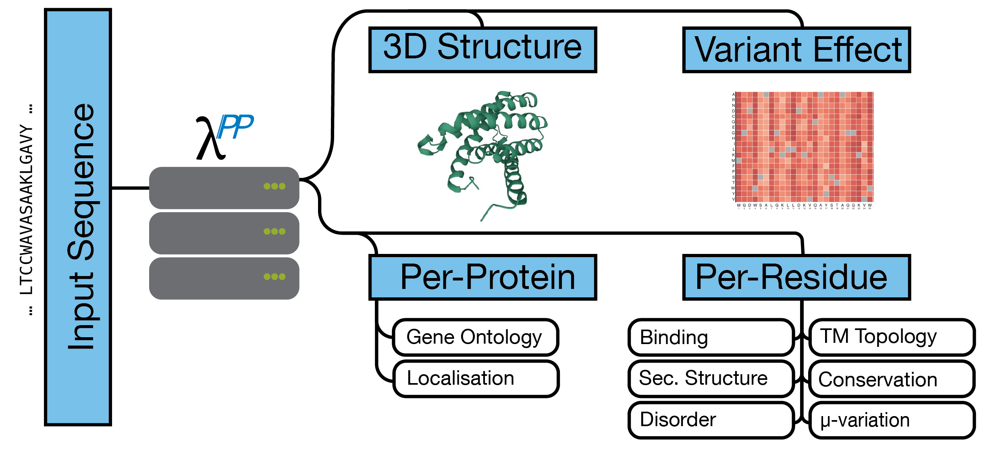

<details>
  <summary markdown="span"> <u><b>Table of Contents</u></b> </summary>

[[_TOC_]]

</details>

# LambdaPP -- Fast and accessible protein-specific phenotype predictions

We introduce LambdaPP, a webserver integrating fast and accurate sequence-only protein feature predictions based on embeddings from protein Language Models (pLMs) in seconds with high-quality protein structure predictions. The intuitive interface invites experts and novices to benefit from the latest machine learning tools. LambdaPP’s unique combination of predicted features may help in formulating hypotheses for experiments and as input to bioinformatics pipelines.

You can find the specifics of LambdaPP in our Paper: [_LambdaPP -- Fast and accessible protein-specific phenotype predictions_(Olenyi et al., 2022)](https://doi.org/10.1101/2022.08.04.502750). The webservice is accessible [here](https://embed.predictprotein.org)

## General Idea

<div align="center" style='background-color: white'></div>

LambdaPP uses fast sequnece only feature predictions and accurate structure predictions to offer a unified, reactive interface which enables exploration and hypothesis building.
Under the hood LambdaPP uses React for the frontend and relies on the API of UniprotKB, AlphafoldDB, and bioembeddings to facilitate predictions.

An overview over the orchestration is shown in the figure above.

## Getting Involved

We're happy to accept pull requests and try to adress issues as quickly as we can.
In order to test your changes, feel free to fork, clone, and execute:

```
npm install
react-scripts start
```

This will create your own local version of the LambdaPP.

Please be advised that while the front-end will run locally, per-default all API calls will still be directed to external services, this includes [UniprotKB](https://www.uniprot.org/help/api), [AlphafoldDB](https://alphafold.ebi.ac.uk/), [FoldSeek](https://search.foldseek.com/search) and the [bioembeddings API](https://github.com/sacdallago/bio_embeddingsfolds). If you want to disable that behavior, feel free to adjust the request hooks in the `src/hooks` directory.

If you want to deploy your own version of the backend, feel free to check out the [bio_embeddings](https://github.com/sacdallago/bio_embeddings) repository for detailled instructions or [chat us up](https://chat.bioembeddings.com/home). If you work on or use LambdaPP, please acknowledge [Rostlab's Core Values](https://rostlab.org/core_values) and our [Code of Conduct](./CODE_OF_CONDUCT.md) in word and spirit.

## External Services

In odrder to provide as high-quality features as possible LambdaPP relies on external services.
We're immensely greatful that the providers of these services have made them accessible and maintain them. If you use LambdaPP for your work please feel free to credit these services as well.

-   [UniprotKB](https://www.uniprot.org/help/api)
-   [AlphafoldDB](https://alphafold.ebi.ac.uk/)
-   [FoldSeek](https://search.foldseek.com/search)
-   [ColabFold](https://github.com/sokrypton/ColabFold)
-   [bioembeddings API](https://github.com/sacdallago/bio_embeddingsfolds)

## How To Cite

While our article is still under review, please cite the pre-print on biorxiv.

<pre>
LambdaPP: Fast and accessible protein-specific phenotype predictions
Tobias Olenyi, Céline Marquet, Michael Heinzinger, Benjamin Kröger, Tiha Nikolova, Michael Bernhofer, Philip Sändig, Konstantin Schütze, Maria Littmann, Milot Mirdita, Martin Steinegger, Christian Dallago, Burkhard Rost
bioRxiv 2022.08.04.502750; doi: [https://doi.org/10.1101/2022.08.04.502750](https://doi.org/10.1101/2022.08.04.502750])
</pre>

```
@article {Olenyi2022.08.04.502750,
	author = {Olenyi, Tobias and Marquet, C{\'e}line and Heinzinger, Michael and Kr{\"o}ger, Benjamin and Nikolova, Tiha and Bernhofer, Michael and S{\"a}ndig, Philip and Sch{\"u}tze, Konstantin and Littmann, Maria and Mirdita, Milot and Steinegger, Martin and Dallago, Christian and Rost, Burkhard},
	title = {LambdaPP: Fast and accessible protein-specific phenotype predictions},
	elocation-id = {2022.08.04.502750},
	year = {2022},
	doi = {10.1101/2022.08.04.502750},
	publisher = {Cold Spring Harbor Laboratory},
	transmembrane proteinTPUtensor processing unit},
	URL = {https://www.biorxiv.org/content/early/2022/08/05/2022.08.04.502750},
	eprint = {https://www.biorxiv.org/content/early/2022/08/05/2022.08.04.502750.full.pdf},
	journal = {bioRxiv}
}
```
